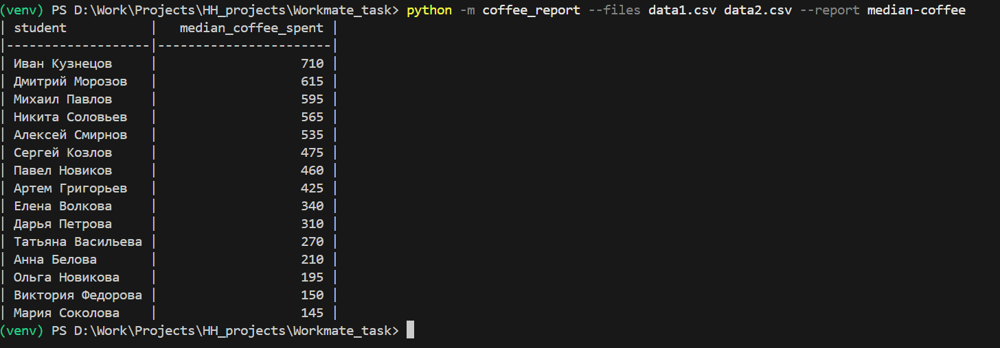
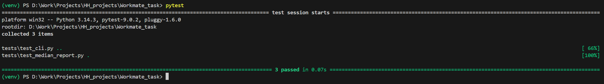

# Отчет о потреблении кофе

Скрипт формирует отчет `median-coffee`: медиана трат на кофе по каждому студенту за все переданные CSV-файлы. Результат выводится в консоль в виде таблицы и сортируется по убыванию медианы.

Пример запуска:

```bash
python -m coffee_report --files data\data1.csv data\data2.csv --report median-coffee
```

Вывод:



Результат тестов:



Зависимости:

```bash
pip install -r requirements.txt
```

Тесты:

```bash
pip install -r requirements-dev.txt
pytest
```

